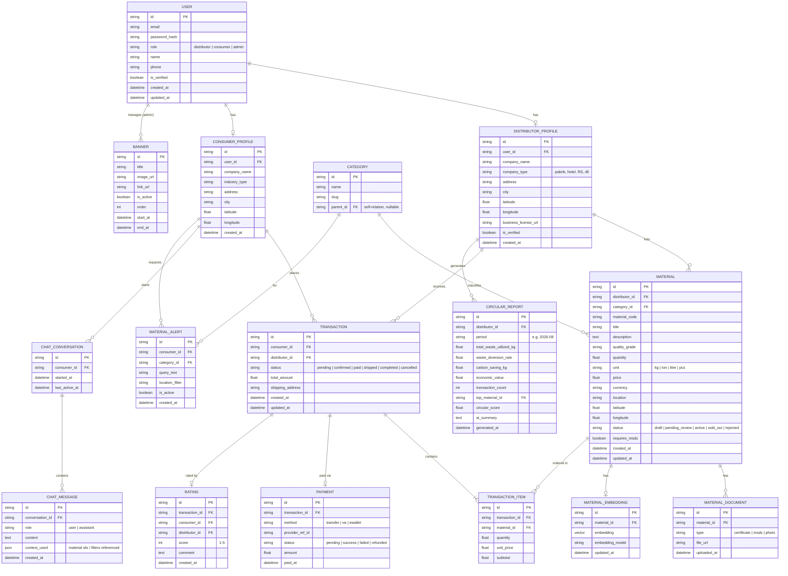

# ERD — ReMat Platform

## 1. Daftar Entitas Utama

1. **User** — akun dasar (distributor / konsumen / admin), autentikasi
2. **DistributorProfile** — profil perusahaan distributor
3. **ConsumerProfile** — profil konsumen (opsional, untuk riwayat & preferensi)
4. **Category** — kategori limbah (plastik, logam, kertas, dst.)
5. **Material** — listing limbah yang dijual distributor
6. **MaterialDocument** — sertifikat / MSDS terlampir pada material
7. **Transaction** — transaksi pembelian (order)
8. **TransactionItem** — (opsional jika multi-item per transaksi)
9. **Payment** — data pembayaran per transaksi
10. **Rating** — rating/ulasan konsumen terhadap distributor/transaksi
11. **CircularReport** — laporan ekonomi sirkular periodik per distributor
12. **ChatConversation** — sesi percakapan AI Assistant
14. **MaterialAlert** — permintaan notifikasi "Buat Alert" saat material tidak ditemukan
15. **Banner** — banner/informasi platform yang dikelola admin
16. **MaterialEmbedding** — representasi vektor material untuk AI Smart Search (vector DB, disebutkan terpisah dari relational DB)

## 2. Diagram ERD (Mermaid)

## 3. Catatan Desain

- **User** adalah tabel akun dasar berisi kredensial & role; profil detail dipisah ke `DistributorProfile` / `ConsumerProfile` agar skema tetap rapi dan mudah diperluas (mengikuti pola Prisma + Supabase Auth: `auth.users` ↔ tabel profil publik).
- **MaterialEmbedding** disimpan terpisah dari `Material` karena secara arsitektur berada di Vector Database (bukan PostgreSQL) — lihat `ARCHITECTURE.md`. Relasi 1-1 di ERD ini menggambarkan hubungan logis, bukan physical join.
- **CircularReport** dihasilkan periodik (misal bulanan) per distributor berdasarkan agregasi `Transaction` + `Material`; `ai_summary` adalah narasi dari LLM, sedangkan angka lain dihitung oleh Analytics Engine (bukan LLM).
- **ChatMessage** menyimpan histori percakapan; aplikasi hanya perlu menampilkan 5 turn terakhir sesuai requirement, tapi data lengkap tetap disimpan untuk audit/analitik.
- **MaterialAlert** mendukung fallback "Skenario 2" (similarity rendah) di PRD — notifikasi ke konsumen saat material yang dicari tersedia di kemudian hari.
- Status transaksi (`Transaction.status`) mengikuti alur bisnis: `pending → confirmed → paid → shipped → completed` (dengan opsi `cancelled` di titik manapun sebelum `completed`).
